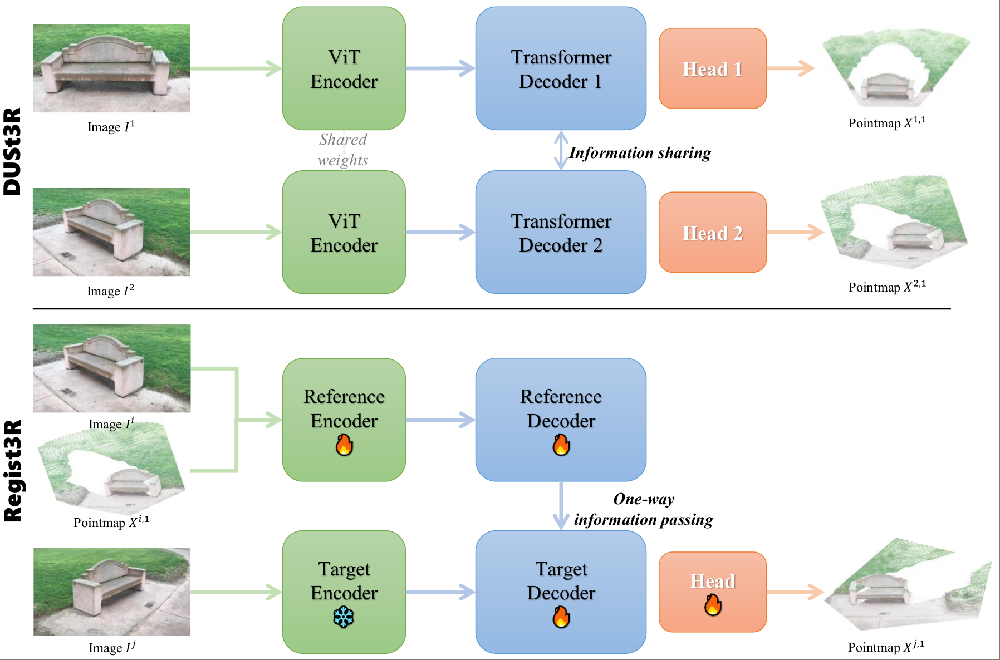

<p align="center">
      
</p>

Official implementation of `Regist3R: Incremental Registration with Stereo Foundation Model`  [[arxiv](https://arxiv.org/abs/2504.12356)]  



```bibtex
@article{liu2025regist3r,
  title={Regist3R: Incremental Registration with Stereo Foundation Model},
  author={Liu, Sidun and Li, Wenyu and Qiao, Peng and Dou, Yong},
  journal={arXiv preprint arXiv:2504.12356},
  year={2025}
}
```

## Get Started

### Installation

Creating environments following [DUSt3R](https://github.com/naver/dust3r).

### Checkpoints

Coming soon.
